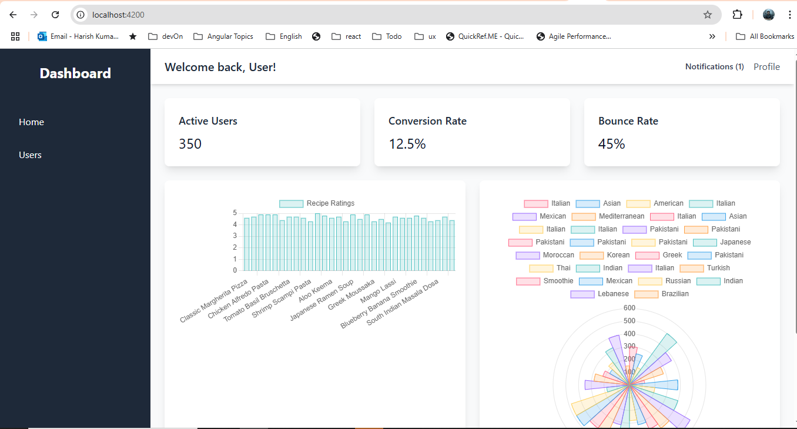
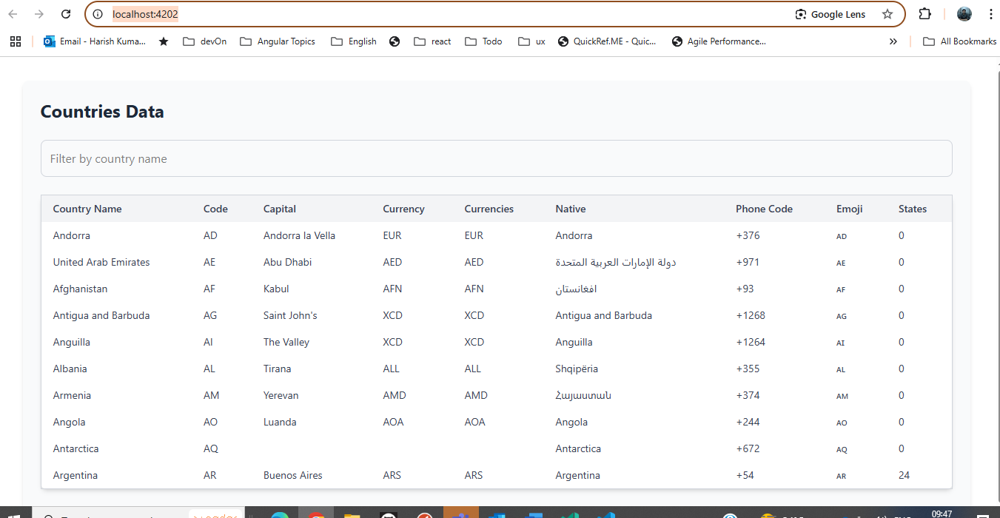
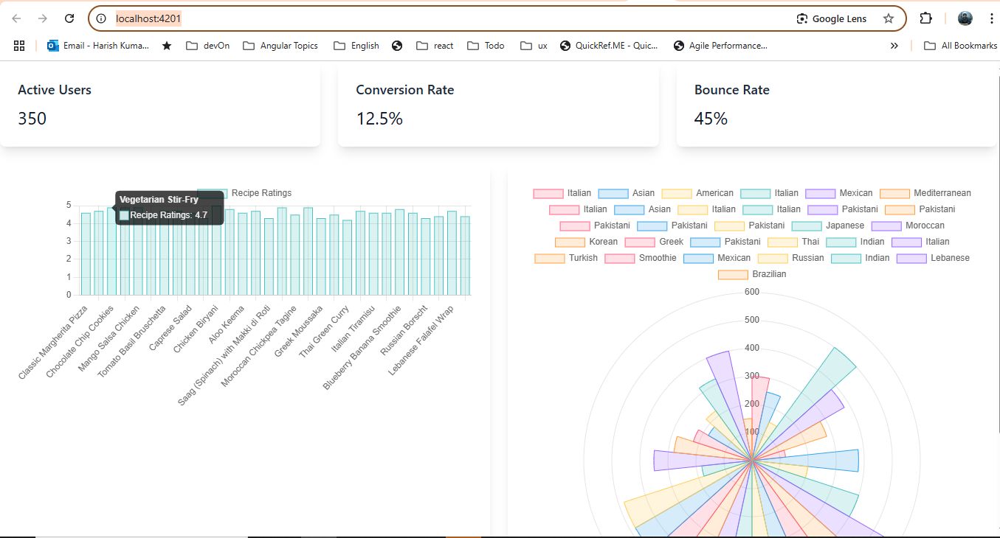

# AngularMfe

This project is a micro-frontend application built using [Angular CLI](https://github.com/angular/angular-cli) version 19.1.7 and Webpack Module Federation. It allows you to create scalable, modular applications by splitting them into smaller, independently deployable micro-frontends.

---

# Micro-Frontend Angular Workspace

This workspace contains three Angular projects:

1. **Shell**: The main application that integrates the micro-frontends.
   
2. **Data-Table**: A micro-frontend that displays a table of data.
   
3. **Remote**: A micro-frontend that displays graphs and charts.
   

## Running the Applications

### 1. Serve the Shell Application

To serve the main shell application and display both the Data-Table and Remote micro-frontends:

```bash
ng serve shell
http://localhost:4200/
```

### 2. Serve the Data-Table Micro-Frontend

To serve the Data-Table micro-frontend independently:

```bash
ng serve data-table
http://localhost:4202/
```

This will display the Data-Table application as a standalone app.

### 3. Serve the Remote Micro-Frontend

To serve the Remote micro-frontend independently:

```bash
ng serve remote
http://localhost:4201/
```

This will display the Remote application with its graph components as a standalone app.

---

## Development Server

To start a local development server, run:

```bash
ng serve
```

Once the server is running, open your browser and navigate to `http://localhost:4200/`. The application will automatically reload whenever you modify any of the source files.

---

## Module Federation

This project uses Webpack Module Federation to enable micro-frontend architecture. Module Federation allows multiple applications to share code and dependencies at runtime, making it easier to build modular and scalable applications.

### Key Features:

- **Host Application**: The `shell` application acts as the host.
- **Remote Applications**: Other micro-frontends can be integrated as remote modules.
- **Shared Dependencies**: Common libraries (e.g., Angular, RxJS) are shared between the host and remote applications to reduce duplication.

To configure Module Federation. For example:

```javascript
const { withNativeFederation, shareAll } = require("@angular-architects/native-federation/config");

module.exports = withNativeFederation({
  name: "shell", // Shell app name
  remotes: {
    remote: "http://localhost:4201/remoteEntry.json",
    "data-table": "http://localhost:4202/remoteEntry.json",
  },
  shared: {
    ...shareAll({ singleton: true, strictVersion: true, requiredVersion: "auto" }),
  },
});
```

---

## Code Scaffolding

Angular CLI includes powerful code scaffolding tools. To generate MFE :

```bash
ng new angular-mfe --create-application=false
ng generate application shell --prefix shell-app
ng generate application data-table --prefix data-table
ng generate application remote --prefix app-remote

ng g @angular-architects/native-federation:init --project shell --port 4200 --type dynamic-host
ng g @angular-architects/native-federation:init --project remote --port 4201 --type remote
ng g @angular-architects/native-federation:init --project remote --port 4201 --type data-table
```

For a complete list of available schematics (such as `components`, `directives`, or `pipes`), run:

```bash
ng generate --help
```

---

## Running Unit Tests

To execute unit tests with the [Karma](https://karma-runner.github.io) test runner, use the following command:

```bash
ng test
```

---

## NPM Packages Used

### Core Angular Packages:

- `@angular/core`: Core Angular framework.
- `@angular/router`: For routing and navigation.

### Webpack and Module Federation:

- `webpack`: For bundling the application.
- `@angular-architects/module-federation`: Simplifies the setup of Module Federation in Angular projects.

### Charting Library:

If you are using charts in your project, the following libraries are recommended:

- `chart.js`: A popular JavaScript charting library.
- `ng2-charts`: Angular wrapper for Chart.js.

To install Chart.js and ng2-charts:

```bash
npm install chart.js ng2-charts
```

Example usage in a component:

```typescript
import { Component } from "@angular/core";

@Component({
  selector: "app-chart",
  template: `<canvas baseChart [data]="chartData" [type]="'bar'"></canvas>`,
})
export class ChartComponent {
  chartData = {
    labels: ["January", "February", "March"],
    datasets: [
      {
        label: "Sales",
        data: [10, 20, 30],
        backgroundColor: ["red", "blue", "green"],
      },
    ],
  };
}
```

---

## Additional Resources

For more information on using the Angular CLI, including detailed command references, visit the [Angular CLI Overview and Command Reference](https://angular.dev/tools/cli) page.

For more details on Webpack Module Federation, visit the [Webpack Module Federation Documentation](https://webpack.js.org/concepts/module-federation/).

---
